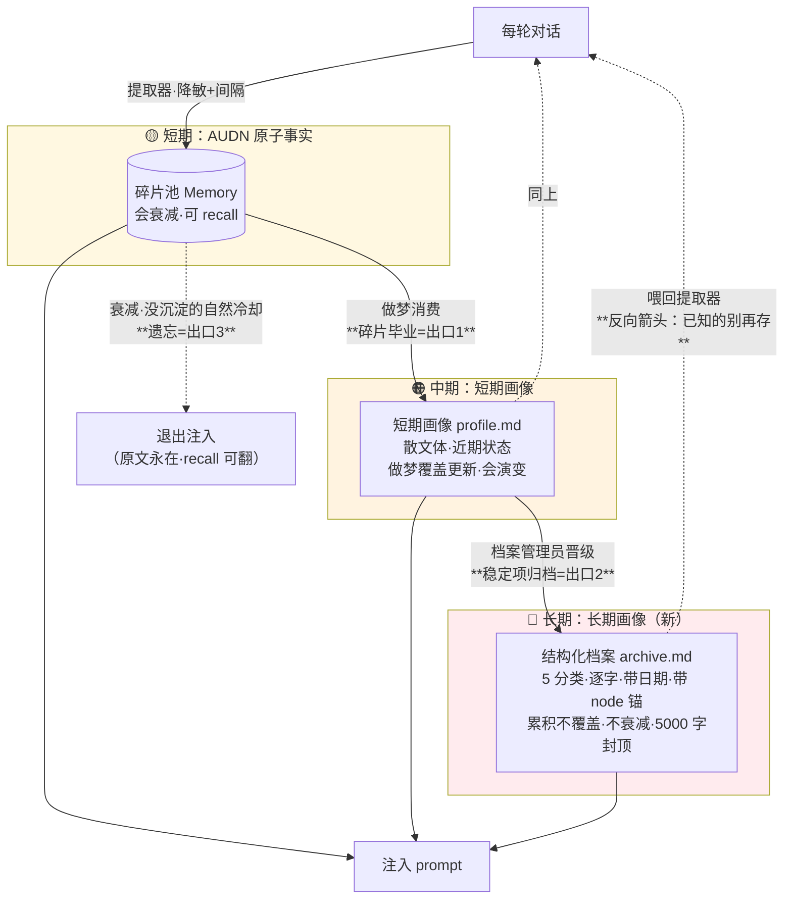

# Roadmap: 记忆系统 v2 — 信噪比治理 + 三级沉淀

> 2026-06-13 · 输入：粟粟实测（189 条记忆/说一条记一条/重复/遗忘没触发/跟画像重复）+ 狗狗拓扑诊断（research-memory-topology 第四节）+ 两层画像设计 + kiwi/paramecium 衰减对标。
> 性质：**路线图，定批次顺序/边界/依赖，不写详单**。各批动工前走 research→plan→implement。
> 前序：记忆系统 M0-M8 已全收官（roadmap-memory-system.md），本文是治理阶段。
> ⚠️ DON'T IMPLEMENT YET — 各批 plan 仍等批注。

---

## 〇、一句话主线

> 狗狗的诊断：**现在的记忆系统是只有进气口、没有排气口的气球。** v2 的全部工作 = 给它装三级排气口，让信息一路往上沉、每级把下级的噪音排掉。

调进气速度（提取降敏）是辅助；**开排气口（碎片毕业 + 画像反馈 + 衰减生效）才是命脉。**

## 一、目标架构：三级沉淀



**三个出口 + 一条反向箭头**（狗狗诊断的落地）：
- 出口1：碎片被做梦消费 → 毕业（不再以碎片身份注入/排名）
- 出口2：短期画像里稳定的 → 晋级长期画像（散文沉淀成档案条目）
- 出口3：没被沉淀也没被想起的碎片 → 衰减冷却退出注入（原文永在，recall 可翻）
- 反向箭头：画像/档案喂回提取器，"已经知道的别再存"——封僵尸回路

## 二、批次（MV1-MV5）

### MV1 · 碎片毕业 + 画像反馈提取器（命脉，先做）

**为什么第一**：狗狗——有出口的系统不需要精密入口；且**封了僵尸回路，衰减（MV3）才能安全生效**。这一刀同时开出口1、补反向箭头、为 MV3 扫雷。

**边界**：
- 做梦成功后，参与聚合的碎片标 `supersededAt`（graduated）——退出注入与排名，不删库。
- 提取器的"已有记忆"列表 = **短期画像全文 + 未毕业碎片**（现在只喂碎片，看不到画像 = 断的反向箭头）。
- `supersededReason` 区分 `graduated`（毕业，决定能否被 recall 搜到）vs `contradicted`（矛盾淘汰，彻底退役）——⧫ 各 plan 定：毕业碎片 recall L1 可见还是只剩 L0 原文兜底。
- 钉住记忆（isUserExplicit）免疫毕业。

**不退化**：mem_supersede_soft 关时毕业不执行；原文永在（毕业不丢信息，最坏退回 recall 翻原话）。

### MV2 · 提取降敏（入口控制，辅助，可穿插）

**为什么辅助**：狗狗——入口控制次要，但减缓进气速度仍有价值（省 API + 减新增噪音）。可与 MV1 并行。

**边界**（plan-memory-hygiene 刀1 的内容并入此批）：
- 提取间隔化：每 N 轮提取一次（✅ 已批 A 轮次方案；N 值各 plan 定）。
- prompt 降敏：规则 8 扩展"不存已有记忆覆盖的（含同义）/同轮重复提及"；记忆超阈值时 add 门槛提高（阈值待定）。

### MV3 · 衰减重设计（research 先行 → plan）

**为什么紧跟 MV1**：衰减是僵尸回路的引信——**MV1 没封回路前不能让衰减生效**，否则衰减杀的碎片被提取器复活。

**research 必答**（粟粟："衰减还没想明白"，对标 kiwi calculate_heat）：
- 抄不抄 kiwi 半衰期模型（`初始温度 × 2^(-天/半衰期) + 召回加成`）替代现在的 `decayWeight × e^(-0.1×天)`？
- **冷启动保护**：access=0 的记忆不走衰减（给重要度底线热度）——对"新提取的记忆不该立刻开始衰减"直接对症。
- **召回延长半衰期**：被 recall 多次的记忆忘得更慢（艾宾浩斯）——现在 reinforce 只 +0.2 不延长半衰期。
- 触发补全：从"仅切换对话"补到"提取后顺手跑"（解决同对话长聊衰减 0 次）。
- 注入分档：要不要加 kiwi 的"中热度 60 字摘要标'印象模糊'"中间态（现在 hot 全文 / warm 直接不注入，没渐变）。

**依赖**：MV1。**先 research 写结论，粟粟拍板抄哪些再 plan。**

### MV4 · 长期画像（结构化档案，大件，research → plan）

**为什么靠后**：依赖 MV1（短期画像稳定、碎片毕业流通后，晋级才有干净的源）。这是 v2 最大新增。

**边界**（粟粟已拍板，各 plan 细化）：
- **形态**：结构化档案 `archive.md`，5 分类 = Instructions / Identity / Career / Projects / Preferences（仿 ChatGPT 官方 memory export 格式）。
- **生成 = 方案 A**：独立"档案管理员"角色定期读短期画像，把稳定项归类进档案（不是提取器双写）。慢动作，不每轮。
- **逐字 + node 锚**：每条 `[YYYY-MM-DD] - 内容`，尽量逐字（尤其 Instructions/Preferences），**至少索引到来源对话 node**（复用 SC-B2 sourceNodeId）。
- **Instructions 单独存**（粟粟："不要再耦合角色卡"）——独立一份，不打通现有角色卡/后置指令。它管"你对小雾/小克怎么说话的要求"，最该逐字最该稳。
- **累积不覆盖**：旧条永驻、oldest first 排序；同类归并/一项目一条（去重在归档时做）。
- **不衰减**：刻在脑子里的。
- **5000 字封顶**（粟粟拍板）——超了怎么办（裁最旧？合并同类？降级目录注入？）各 plan 定。
- **注入**：全文进缓存前缀，与 B4 多块断点（短期画像/长期画像各自缓存块）呼应。

### MV5 · 存量整理（一次性清洗，收尾）

**为什么最后**：流程改善（MV1-4）只管增量；手机上堆的 189 条要一次性洗。依赖 MV1/MV4 的去重+毕业+画像重叠判断就绪。

**边界**（plan-memory-hygiene 刀4 并入）：
- 设置页「整理记忆」入口：全库向量查近似对（>0.75）合并 + 与画像重叠的碎片毕业 + 报告"合并 X / 毕业 Y / 剩余 Z"。
- ✅ 已批：自动跑 or 手动触发可选；跑前二次确认。

## 三、顺序与依赖

```
MV1 碎片毕业+画像反馈 ──┬──→ MV3 衰减重设计（research先行，回路已封才安全）
   （命脉，先做）        └──→ MV4 长期画像（短期画像稳定后晋级）──→ MV5 存量整理
MV2 提取降敏（辅助，可与 MV1 并行/穿插）
```

风险/价值排序（狗狗"出口优先"）：**MV1 > MV3 ≈ MV4 > MV2 > MV5**。MV1 是有没有出口的问题，其余是出口够不够顺的问题。

## 四、决策记录（2026-06-13 粟粟已拍板）

1. 三层生命周期 → **两层画像**（短期画像散文 / 长期画像档案）✅
2. 长期画像晋级 → **方案 A**（档案管理员从短期画像提炼，非提取器双写）✅
3. 逐字保真 → **至少索引来源对话 node**（sourceNodeId）✅
4. Instructions → **单独存，不耦合角色卡** ✅
5. 长期画像字数 → **5000 封顶** ✅
6. 提取间隔 → **A 轮次方案**（N 值待定）✅
7. 存量整理 → 自动/手动可选，跑前二次确认 ✅
8. 写时近似去重（sim>0.75 reinforce）→ 已落地（增量防线，MV5 存量补全）

## 五、各批 plan 待定的开放问题

- MV1：毕业碎片 recall L1 可见性（graduated 能搜 vs 彻底退役）
- MV2：提取间隔 N 值 / 记忆超阈值的 add 门槛阈值
- MV3：抄 kiwi 哪几样（半衰期/冷启动/召回延长/情绪/分档）— 整个 research
- MV4：5000 字超限策略 / 档案管理员触发频率 / 注入全文 vs 目录
- 全局：MV3 衰减重设计与 MV1 上线后的日用观察绑定（先看 MV1 效果再定衰减狠不狠）

## 六、与其他线的关系

- **plan-memory-hygiene.md**：内容拆入 MV1（刀2 毕业）/ MV2（刀1 降敏）/ MV3（刀3 衰减）/ MV5（刀4 存量）——**该文件降级为 MV1-5 的素材来源，不再单独执行**。
- **SC-B4 多块断点**：长期画像/短期画像各自缓存块 = B4 刀6 的 BP2 候选，MV4 落地时对齐。
- **SC-B2 quote 锚**：MV1 毕业 + MV4 逐字索引都复用 sourceNodeId，已就位。
- **kiwi（B5 停车）**：外部记忆是平行源，不进三级沉淀（只读注入，生命周期归外部）。

## 七、Checklist

- [ ] MV1 碎片毕业 + 画像反馈提取器（命脉）
- [ ] MV2 提取降敏（间隔化 + prompt）
- [ ] MV3 衰减重设计（research → plan）
- [ ] MV4 长期画像（research → plan，大件）
- [ ] MV5 存量整理（一次性清洗）
