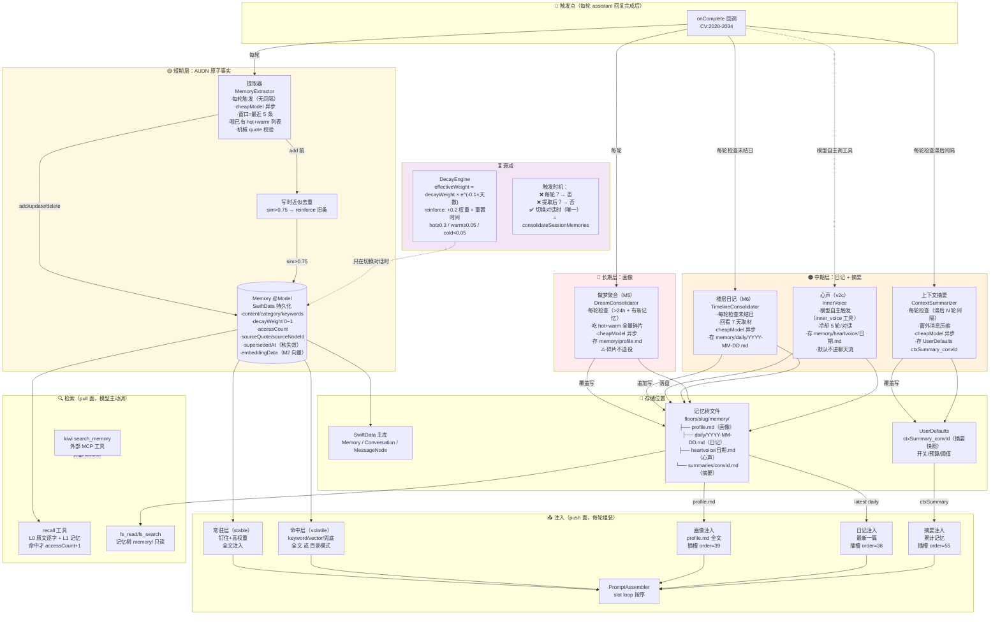

# Research: 记忆系统拓扑 — 全组件触发/衰减/注入/存储地图

> 2026-06-13 · 亲核行号 @ master HEAD。不动代码，纯盘点。
> 目的：搞清楚现在记忆系统里到底有多少个东西在跑、谁触发谁、谁注入哪里、谁会衰减谁不会。
> 配合 `research-context-topology.md` 第七节（上下文供应链拓扑）一起看。

---

## 一、全景图



## 二、逐组件详表

### 短期层：AUDN 原子事实

| 项 | 详情 |
|---|---|
| **触发** | 每轮 onComplete，**无间隔无节流**（CV:2021） |
| **输入** | 最近 5 条消息 + 已有 hot+warm 记忆列表 |
| **模型** | cheapModel（同 provider 最便宜的） |
| **产出** | add（带 quote 校验）/ update / delete（→supersede） |
| **去重** | 全等 Set + 写时近似（sim>0.75，刚落地未推手机） |
| **衰减** | effectiveWeight = decayWeight × e^(-0.1×天数)；reinforce: +0.2 + 重置时间 |
| **衰减触发** | **仅切换对话时**（consolidateSessionMemories）——同一对话聊 100 轮衰减 0 次 |
| **注入** | hot(≥0.3) 全文或目录行；warm(0.05~0.3) 不注入但可 recall 搜到；cold(<0.05) 不注入不搜 |
| **问题** | ① 每轮提取太激进 ② 与画像重复注入 ③ 同义重复堆积 ④ 衰减触发太少 |

### 中期层：日记

| 项 | 详情 |
|---|---|
| **触发** | 每轮检查未结日（TimelineConsolidator.pendingMaterials，CV:2517） |
| **判定** | 回看 7 天，找没有 daily note 且有对话发生的日子，每次最多结一天 |
| **输入** | 该日的上下文摘要 + 对话标题 + 用户消息采样 |
| **模型** | cheapModel 异步 |
| **产出** | `memory/daily/YYYY-MM-DD.md`（frontmatter + 正文） |
| **衰减** | **无**——文件永驻，最新一篇注入 |
| **注入** | 最新一篇全文 → 插槽 order=38（天级稳定，进缓存前缀） |

### 中期层：上下文摘要

| 项 | 详情 |
|---|---|
| **触发** | 每轮检查（triggerContextSummaryIfNeeded，CV:2026） |
| **判定** | 窗外新增 ≥ compressIntervalRounds×2 条才压缩（滞后 N 轮间隔，稳定缓存前缀） |
| **输入** | 已有摘要 + 窗外新增消息 |
| **模型** | cheapModel 异步 |
| **产出** | UserDefaults `ctxSummary_{convId}`（覆盖更新）+ `memory/summaries/{convId}.md`（文件态镜像） |
| **衰减** | **无**——覆盖更新语义，旧内容被新版替代 |
| **注入** | 最新摘要全文 → 插槽 order=55（压缩触发时 miss 一次缓存，之后稳定） |
| **噪音规则** | 已加：系统报错不记 / 决策与安抚分清 / 同事件不重复（SC-B2 刀4） |

### 中期层：心声

| 项 | 详情 |
|---|---|
| **触发** | **模型自主**——聊到触动处调 `inner_voice` 工具（不是系统自动，是 AI 自己决定） |
| **节流** | 冷却 5 轮/对话（同对话 10 条消息内只许一次） |
| **输入** | 当前完整上下文（复用缓存前缀）+ 尾部换"放下逻辑凭本能"指令 |
| **模型** | 主对话模型（不是 cheapModel——心声要质量） |
| **产出** | `memory/heartvoice/{date}-{HHmm}.md` |
| **注入** | **默认不注入聊天流**（showInChat=false）；落盘进记忆树，日记收割时取材 |
| **衰减** | **无**——文件永驻 |

### 长期层：画像

| 项 | 详情 |
|---|---|
| **触发** | 每轮检查（dreamIfNeeded，CV:2022） |
| **判定** | 开关开 + 有记忆 +（无画像 或 距上次>24h 且记忆有新增）（DreamConsolidator:52） |
| **输入** | 已有画像 + **hot+warm 全量碎片**（纯值，不带 id） |
| **模型** | cheapModel 异步 |
| **产出** | `memory/profile.md`（覆盖写） |
| **衰减** | **无**——覆盖更新语义 |
| **注入** | 画像全文 → 插槽 order=39（几乎不变，缓存前缀核心） |
| **⚠️ 核心问题** | **碎片不退役**：做梦吃的碎片事后仍在库里→同一事实画像全文注入一份+碎片行注入一份=双倍占预算 |

### 向量子系统

| 项 | 详情 |
|---|---|
| **触发** | 每轮注入 fetch 时顺手检查（MemoryEmbeddingBackfill.run，CV:1378） |
| **条件** | mem_inject_vector 开关开 + Apple NLContextualEmbedding 资产就绪 |
| **做什么** | 给缺向量/版本过期的 Memory 补算嵌入；M3 启动扫一次补边（relatedIds） |
| **衰减** | 向量本身不衰减；向量参与 VectorRetriever 检索 → 被 recall 命中时 reinforce |

### 记忆树文件系统

| 项 | 详情 |
|---|---|
| **结构** | `floors/{slug}/memory/` 下：profile.md / daily/ / heartvoice/ / summaries/ |
| **可达性** | AI 通过 `fs_list`/`fs_read`/`fs_search` 只读访问（v1 规则：系统生成不让 AI 改） |
| **用途** | AI "照镜子"看自己的画像/日记/心声/摘要——提示词引导"看看你的记忆树"有效（B0 验证 ✅） |

## 三、衰减机制对比（我们 vs kiwi）

| 维度 | 我们（DecayEngine） | kiwi（calculate_heat） |
|------|-------------------|----------------------|
| **公式** | `decayWeight × e^(-0.1×天数)` | `初始温度 × 2^(-天数/半衰期) + 召回加成` |
| **计算方式** | **写回式**（applyDecay 写回 decayWeight） | **惰性**（每次读实时算，不存中间态） |
| **触发时机** | 切换对话时（唯一） | 每次读记忆时实时 |
| **半衰期** | 固定 ~7 天（e^-0.1 → 半衰期 ≈ 6.9 天） | 可配置：普通 3 天 / 重要 7 天 |
| **召回延长** | ❌ reinforce 只加 0.2 权重 | ✅ 半衰期 × (1 + access × 0.5)——艾宾浩斯 |
| **冷启动保护** | ❌ 没有 | ✅ access=0 的记忆不走衰减，给稳定底线热度 |
| **情绪权重** | ❌ 没有 | ✅ emotional_weight 影响初始温度和半衰期 |
| **注入分档** | hot 全文 / warm 不注入 / cold 不注入 | 高热全文 / 中热 60 字摘要标"印象模糊" / 低热不注入 |
| **钉住** | isUserExplicit → 权重锁 1.0 | is_permanent → 热度锁 1.0 |

## 四、现状问题总结（这张图暴露的）

```
问题 1: 提取无间隔 ──→ 每轮一次 API 调用 ──→ 说一条记一条
问题 2: 碎片不毕业 ──→ 画像+碎片双倍注入 ──→ 预算浪费
问题 3: 衰减只在切换对话触发 ──→ 同对话长聊不衰减 ──→ 遗忘不生效
问题 4: 无"印象模糊"中间态 ──→ hot 或不注入，没有渐变
问题 5: 无冷启动保护 ──→ 新记忆从没被 recall 就开始衰减
问题 6: reinforce 不延长半衰期 ──→ 被多次想起的记忆和只想过一次的衰减速度一样
问题 7: 摘要在 system 大段中间 ──→ 压缩触发毁整段缓存（B4 刀6 解决）
```

> 本文档是盘点，不是方案。方案见 `plan-memory-hygiene.md`（提取降敏+碎片毕业+衰减补全）+ 将来的衰减引擎重设计（是否抄 kiwi 半衰期模型，待粟粟想明白）。
